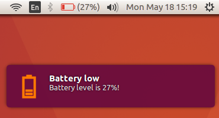
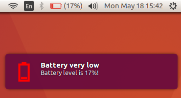
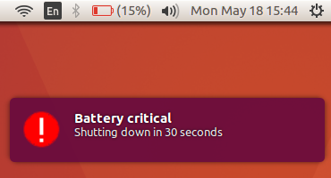
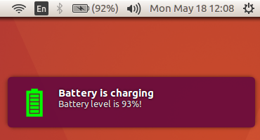

# Custom Battery Notifications in Ubuntu 16.04
Display battery related notifications with `notify-send` in Ubuntu 16.04 with crontab  

### While Discharging



### While Charging


## Features
While discharging following notifications are issued:
* Low battery level notification (battery < 30%)
* Very low battery level notification (battery < 20%)
* Critical battery notification (battery < 15%) and automatic shutdown after 30 seconds  

While charging, a notification will be issued when battery > 92%

## Steps to Run
1. Install acpi: `sudo apt-get install acpitool`
2. Clone this repo
3. Edit `notify-me.sh` file. Change the paths of the notification icons at 4 places and save.
4. Create a cornjob to execute `notify-me.sh` every minute automatically.
```bash
$ crontab -e
# 
# Each task to run has to be defined through a single line
# indicating with different fields when the task will be run
# and what command to run for the task
# 
# To define the time you can provide concrete values for
# minute (m), hour (h), day of month (dom), month (mon),
# and day of week (dow) or use '*' in these fields (for 'any').# 
# Notice that tasks will be started based on the cron's system
# daemon's notion of time and timezones.
# 
# Output of the crontab jobs (including errors) is sent through
# email to the user the crontab file belongs to (unless redirected).
# 
# For example, you can run a backup of all your user accounts
# at 5 a.m every week with:
# 0 5 * * 1 tar -zcf /var/backups/home.tgz /home/
# 
# For more information see the manual pages of crontab(5) and cron(8)
# 
# m h  dom mon dow   command
* * * * * sh /home/abhinav/Downloads/battery-notification/notify-me.sh
```
Add the last line. Make sure that you write the absolute path.

5. If you want the automatic shutdown feature, you need to allow shutdown
for all the users. This can be done using 
```bash
sudo chmod u+s /sbin/shutdown
```
6. You're all set :)

## Helpful Links
* Simple icon maker: http://www.xiconeditor.com/ 
* Shutdown without sudo: https://linux.byexamples.com/archives/315/how-to-shutdown-and-reboot-without-sudo-password/
* If not working: https://askubuntu.com/questions/298608/notify-send-doesnt-work-from-crontab